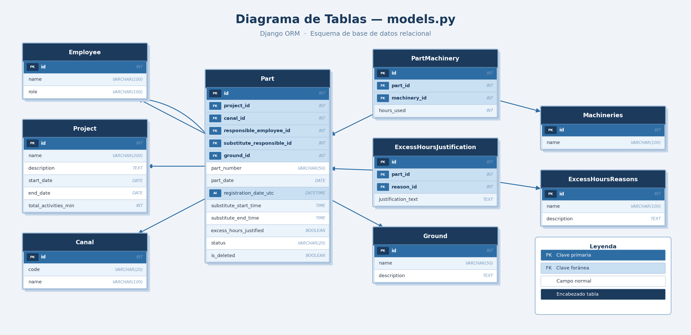
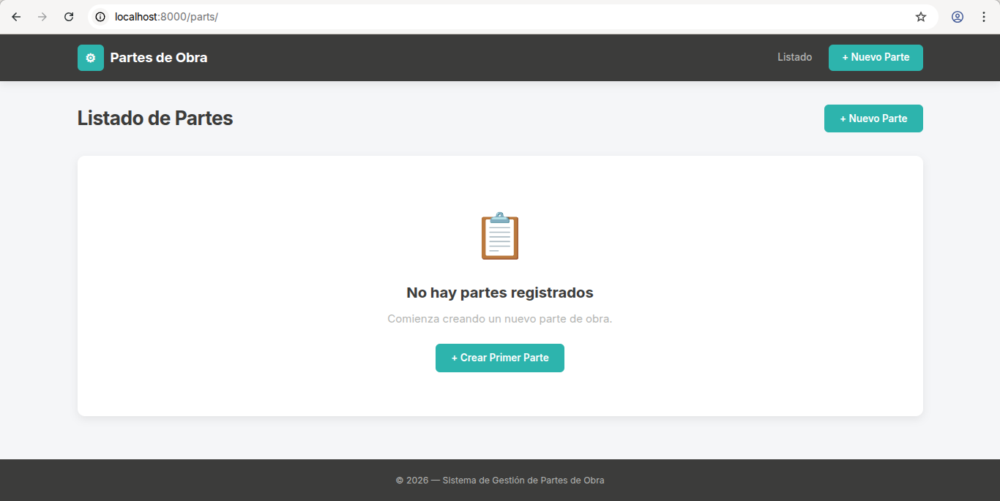
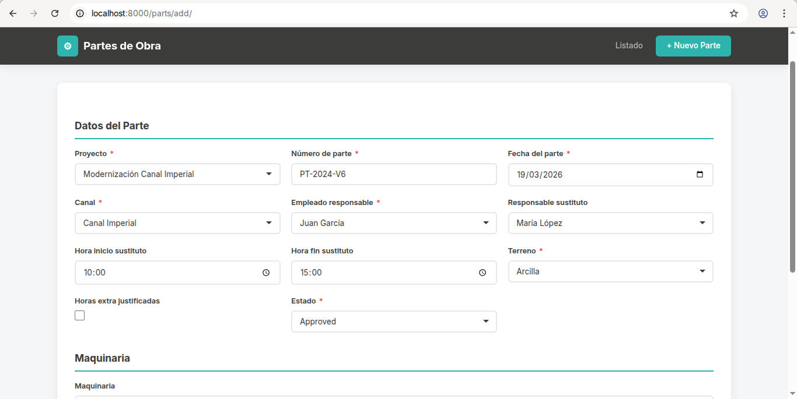
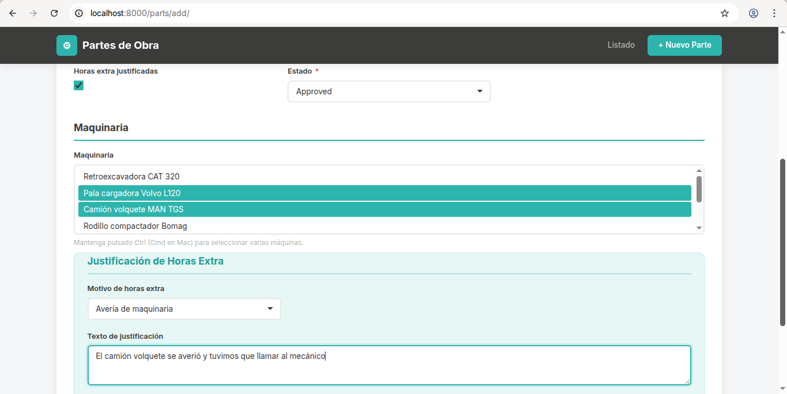
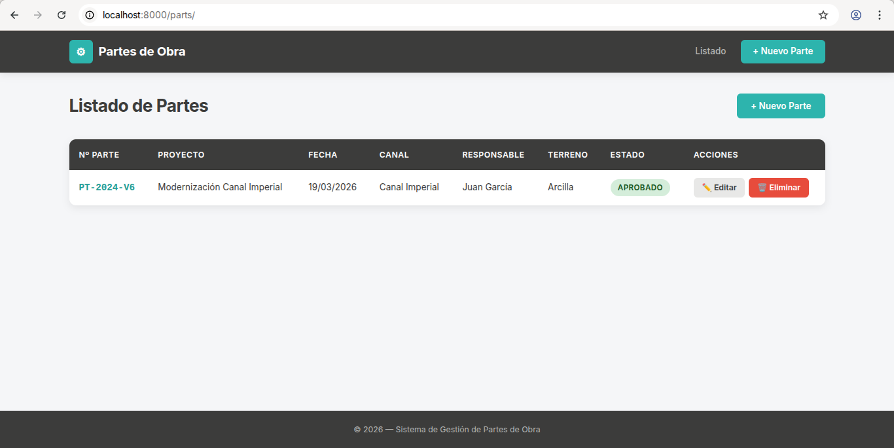
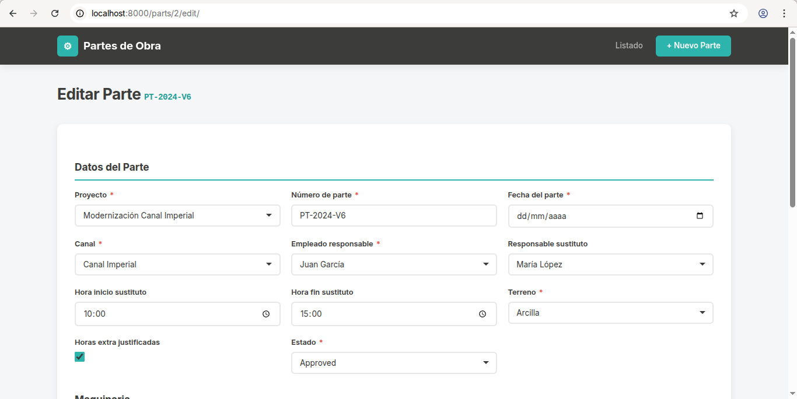
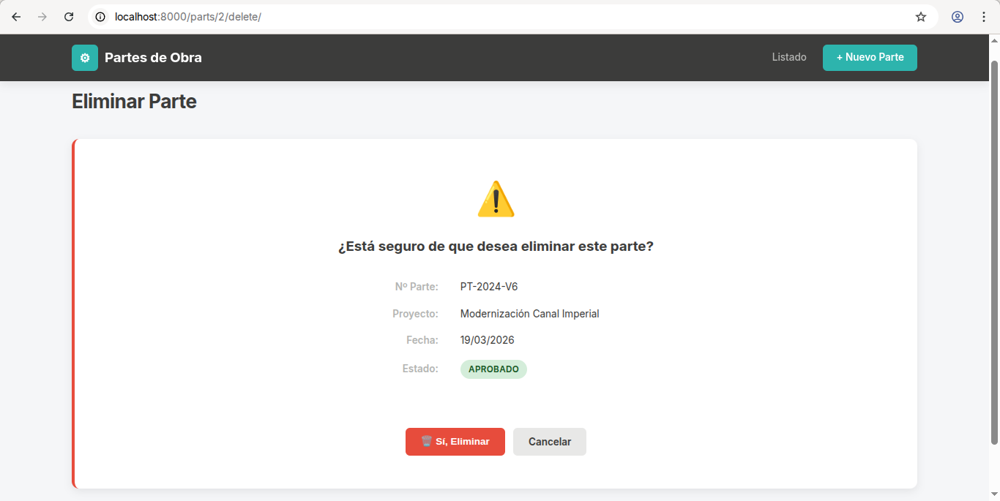

# Proyecto: Gestión de Partes de Obra

## Descripción

Aplicación web para la gestión de **partes de obra**.

Permite crear, visualizar, editar y eliminar (mediante borrado lógico) partes asociados a proyectos de construcción, incluyendo información sobre responsables, maquinaria utilizada y posibles excesos de horas.

---

## Modelo de la Base de Datos

El modelo se ha diseñado siguiendo principios de **normalización** y coherencia estructural, separando entidades para evitar redundancia y facilitar el mantenimiento.

### Entidades principales
Diagrama de paso a tablas de la BB.DD


- **Project (Proyecto / Obra):** Representa una obra. Puede tener múltiples partes. Incluye el total de minutos de actividades.

- **Part (Parte de obra):** Entidad principal del sistema. Incluye:
  - Número de parte
  - Fecha del parte
  - Fecha de registro
  - Responsable
  - Relevo (sustituto)
  - Canal
  - Terreno
  - Estado
  - Indicador de exceso de horas
  - Borrado lógico (`is_deleted`)

- **Employee (Empleado):** Trabajadores del sistema.

- **Canal:** Ubicación donde se realiza la obra (ej: canal, acequia, tramo).

- **Ground (Terreno):** Tipo de terreno (arcilla, roca, arena, etc.).

- **Machineries (Maquinaria):** Equipos utilizados en obra.

- **PartMachinery:** Relación entre partes y maquinaria, permitiendo registrar qué maquinaria se ha utilizado en cada parte.

- **ExcessHoursReasons:** Catálogo de motivos de exceso de horas.

- **ExcessHoursJustification:** Justificación del exceso de horas asociada a un parte.

---

## Despliegue

### 1. Configuración de entorno

Crear archivo `.env` con las siguientes variables o las credenciales que se deseen:

```env
POSTGRES_USER=django
POSTGRES_PASSWORD=django
POSTGRES_DB=projectdb
POSTGRES_HOST=db
POSTGRES_PORT=5432
DJANGO_SECRET_KEY=tu_clave_secreta
```

### 2. Construcción y ejecución

```bash
docker compose build --no-cache
docker compose up
```

El contenedor ejecuta automáticamente:

- Migraciones
- Carga de datos de prueba
- Arranque del servidor Django

> ⚠️ **Advertencia:** No ejecutar `docker compose down -v`. Esto eliminará el volumen de la base de datos.

---

## Datos de prueba

Se incluyen datos iniciales para todas las tablas principales:

- Employee
- Project
- Canal
- Ground
- Machineries
- ExcessHoursReasons

Esto permite que la aplicación sea usable desde el inicio sin necesidad de inserciones manuales.

Para cargar los datos de prueba se puede ejecutar el siguiente comando:

```bash
docker compose exec web python manage.py seed_data
```

---

## Consideraciones

### Tecnologías

- **Django:** Framework backend principal. Permite estructurar la aplicación de forma clara y mantenible. Y reutilizar muchas de las utilidades que ofrece (plantillas para la vistas, ORM, paginación, api rest ... etc).
- **Django REST Framework (DRF):** Permite desacoplar backend y frontend mediante API REST.
- **Django Templates:** Adecuado para este caso al tratarse de un CRUD sencillo.
- **PostgreSQL:** Base de datos relacional robusta y preparada para concurrencia.

### Cuestiones de lógica y especificaciones

- Se ha optado por asociar la maquinaria con los partes, con el objetivo de poder identificar qué responsable de obra ha sido responsable del uso de cada maquinaria.
- Se han añadido más tablas de las estrictamente solicitadas para mejorar la normalización y evitar campos nulos innecesarios.
- **Relevo:** Se interpreta como el trabajador que sustituye al responsable del parte.
- **Proyecto / Obra:** Se considera una entidad independiente.
- **Actividades:** Se asume que pertenecen al proyecto, por lo que `total_activities_min` se ubica en `Project`.
- **Fechas:**
  - `part_date`: fecha real del parte.
  - `registration_date_utc`: fecha de registro en el sistema.
- **Canal:** Lugar donde se realiza la obra.
- **Terreno:** Tipo de superficie donde se ejecuta la obra.
- Se ha evitado el uso de nomenclatura ambigua como `pk_inicio`, optando por nombres más claros.
- **Estado (`status`):** Define el estado del parte (pendiente, aprobado, etc.).
- **Adjuntos:** No se han implementado por falta de especificación clara.

### Integridad de datos

- Se utiliza borrado lógico (`is_deleted`) en `Part`.
- Se emplea `on_delete=PROTECT` en las relaciones para evitar pérdida accidental de datos y mantener integridad referencial.

### Rendimiento

Se han tenido en cuenta optimizaciones básicas:

- Uso de `select_related` en relaciones FK.
- Uso de `prefetch_related` en relaciones inversas.

Esto evita problemas típicos de consultas N+1.

### Formularios y validación

- Uso de `ModelForms` para garantizar coherencia entre modelo y formulario.
- Los formularios respetan las restricciones definidas en los modelos (`max_length`, tipos, `required`).
- En los formularios de creación y edición:
  - Se incluyen relaciones mediante selects.
  - Se permite asociar maquinaria.
  - Se gestiona la justificación de exceso de horas de forma condicional.

### Estándares

- El código fuente está en inglés, siguiendo estándares habituales en desarrollo de software.
- Los formularios están en español.
- Se ha utilizado **Git Flow** como estrategia de control de versiones.

---

## Estructura del proyecto

```
/construction_parts
├── docker-compose.yml
├── .env
├── requirements.txt
├── mysql-init/
├── core/
├── templates/
├── static/
└── project/
```

---

## Vistas de la aplicación

Listado sin partes


Añadir un parte



Listado con el parte añadido


Modificar un parte


Eliminar un parte



## Conclusión

Se ha priorizado una solución sencilla pero estructurada, aplicando buenas prácticas habituales para evitar problemas comunes en aplicaciones reales, manteniendo al mismo tiempo la simplicidad requerida.